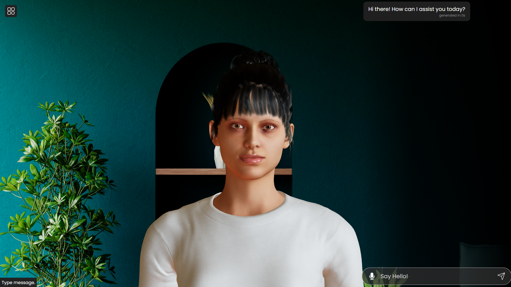

# Talking avatar


A ThreeJS-powered virtual human being that uses a set of neat [Azure APIs](https://learn.microsoft.com/en-us/azure/cognitive-services/speech-service/how-to-speech-synthesis-viseme) to do some talking! Added Chat GPT to the mix and maybe you can have for yourself a nice face to chat with. 🙂



## Run
```
npm install 
npm start


yarn
yarn start
```

## Backend
You'll also need https://github.com/vaibhav1663/talking_avatar_backend for the text to speech conversion.
